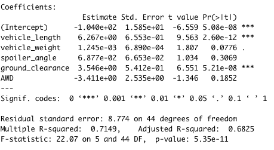
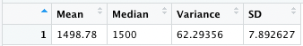
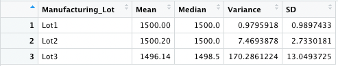

# MechaCar Statistical Analysis
# Overview

# Results
### Linear Regression to Predict MPG
 
- The intercept, vechicle length and ground clearance provide the most non-random variation of all the variables.
- The slope of the linear model is not considered to be zero as the r-squared value is .7149 and the p-value is extremely small.
- This model effectively, although not perfectly, predicts the mpg of MechaCar prototypes becuase teh r0squared value is .7149, meaning 71% of the variation is explained by the model.

### Deliverable 2: Summary Statistics on Suspension Coils
 
 
As these tables show, in total the lots comprising our data meet the specification requiring less 100 lbs variation in PSI.  When considered the lots individually, however, Lot3 shows a large variance which exceeds the maximum allowable variation.

### Deliverable 3: T-Test on Suspension Coils

# Design a Study Comparing the MechaCar to the Competition
